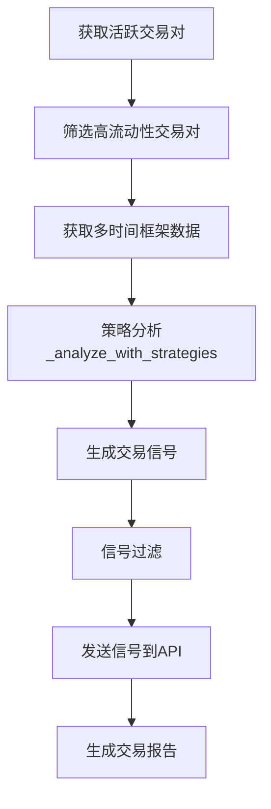

# 加密货币量化交易系统项目总结

## 1. 项目概述

本项目是一个专业级加密货币量化交易系统，集成了多维度技术分析、智能信号生成和严格风险管理功能。系统支持多种交易策略，特别是多时间框架分析策略，能够为不同交易风格的用户提供全面的交易决策支持。

### 1.1 系统定位

- **目标用户**：加密货币交易者、量化投资者、交易团队
- **应用场景**：日内交易、波段交易、长期投资分析
- **核心价值**：提供客观、系统化的交易信号，降低人为情绪干扰，优化风险管理

### 1.2 主要功能亮点

- **多时间框架分析**：从周线到15分钟线等多个时间维度综合分析
- **智能信号过滤**：多因子模型评分，严格的信号确认机制
- **风险管理系统**：基于ATR的动态止损，仓位控制，风险敞口管理
- **实时数据处理**：高效的市场数据获取和分析流程
- **API集成**：与OKX交易所深度集成，支持信号发送和仓位管理

## 2. 系统架构

### 2.1 整体架构设计

系统采用模块化、分层架构设计，主要包含以下几个核心层次：

1. **数据获取层**：负责从交易所API获取实时和历史市场数据
2. **策略分析层**：包含基础策略类和具体策略实现，进行多维度技术分析
3. **信号处理层**：对分析结果进行过滤、验证和优化
4. **风险管理层**：实现止损、仓位管理和风险控制逻辑
5. **API交互层**：与外部系统和交易所进行通信
6. **报告生成层**：创建详细的交易报告和分析结果

### 2.2 目录结构

```
├── multi_timeframe_system.py    # 主系统入口文件
├── strategies/                  # 策略模块目录
│   ├── base_strategy.py         # 策略基类
│   ├── multi_timeframe_strategy.py  # 多时间框架策略实现
│   └── condition_analyzer.py    # 条件分析器
├── lib/                         # 工具库
│   ├── tool/                    # 通用工具
│   └── python-okx-master/       # OKX官方API库
├── lib2.py                      # 核心功能函数库
├── models/                      # 数据库模型
├── report_viewer_python/        # 报告查看器前端
├── test/                        # 测试文件目录
├── md/                          # 文档目录
└── config_template.py           # 配置模板
```

### 2.3 核心流程图



## 3. 核心模块详解

### 3.1 多时间框架系统 (MultiTimeframeProfessionalSystem)

核心系统类，协调整个交易分析流程：

- **初始化配置**：连接交易所、注册策略、创建报告目录
- **数据获取**：获取活跃交易对，筛选高流动性交易对
- **并行分析**：使用线程池进行高效的多交易对并行分析
- **信号处理**：收集、过滤和发送交易信号
- **报告生成**：创建详细的交易报告

关键方法：
- `run_analysis()`：执行完整的分析流程
- `_analyze_with_strategies()`：使用注册的策略分析数据
- `_filter_opportunities()`：过滤和优化交易机会

### 3.2 策略模块 (Strategies)

#### 3.2.1 策略基类 (BaseStrategy)

定义所有策略必须实现的接口和基础功能：

- **抽象方法定义**：`analyze()` 和 `get_required_timeframes()`
- **配置管理**：策略参数的获取和更新
- **交易所连接**：初始化和维护交易所API连接

#### 3.2.2 多时间框架策略 (MultiTimeframeStrategy)

实现具体的多时间框架分析逻辑：

- **策略配置**：包含买入/卖出阈值、ATR周期、目标/止损倍数等参数
- **信号生成**：创建MultiTimeframeSignal对象，包含完整交易信号信息
- **多维度分析**：综合分析不同时间框架的技术指标和趋势
- **风险控制**：计算动态止损和目标价格

#### 3.2.3 条件分析器 (condition_analyzer)

提供各种技术指标的计算和评分功能：

- **趋势指标**：计算SMA、EMA等趋势指标和对应评分
- **动量指标**：实现RSI计算和评分逻辑
- **成交量分析**：计算成交量评分
- **交叉信号**：检测RSI等指标的交叉信号

### 3.3 工具函数库 (lib2.py)

提供系统核心功能函数：

- **ATR计算**：计算平均真实波动幅度，用于风险管理
- **交易所交互**：获取OKX持仓信息，处理交易所API调用
- **信号发送**：将交易信号发送到外部API
- **Redis缓存**：实现数据缓存功能，提高性能

### 3.4 报告查看器 (report_viewer_python)

提供Web界面查看交易报告和管理功能：

- **用户认证**：基本的登录验证功能
- **报告管理**：查看和管理交易报告
- **OKX交互**：获取交易所数据和管理订单
- **配置管理**：调整系统参数和设置

## 4. 技术栈与依赖

| 类别 | 技术/库 | 用途 | 来源 |
|------|---------|------|------|
| 开发语言 | Python 3.7+ | 主要开发语言 | <mcfile name="requirements.txt" path="d:\code\Cryptocurrency-Quantitative-Trading-System\requirements.txt"></mcfile> |
| 交易API | CCXT | 交易所连接和数据获取 | <mcfile name="multi_timeframe_system.py" path="d:\code\Cryptocurrency-Quantitative-Trading-System\multi_timeframe_system.py"></mcfile> |
| OKX API | python-okx-master | OKX交易所官方API | <mcfile name="strategies/multi_timeframe_strategy.py" path="d:\code\Cryptocurrency-Quantitative-Trading-System\strategies\multi_timeframe_strategy.py"></mcfile> |
| 数据分析 | pandas, numpy | 数据处理和分析 | <mcfile name="multi_timeframe_system.py" path="d:\code\Cryptocurrency-Quantitative-Trading-System\multi_timeframe_system.py"></mcfile> |
| 技术指标 | talib | 计算技术分析指标 | <mcfile name="multi_timeframe_system.py" path="d:\code\Cryptocurrency-Quantitative-Trading-System\multi_timeframe_system.py"></mcfile> |
| 缓存系统 | Redis | 数据缓存和性能优化 | <mcfile name="lib2.py" path="d:\code\Cryptocurrency-Quantitative-Trading-System\lib2.py"></mcfile> |
| Web框架 | Flask | 报告查看器Web界面 | <mcfile name="report_viewer_python/app.py" path="d:\code\Cryptocurrency-Quantitative-Trading-System\report_viewer_python\app.py"></mcfile> |
| 并发处理 | concurrent.futures | 并行数据处理 | <mcfile name="multi_timeframe_system.py" path="d:\code\Cryptocurrency-Quantitative-Trading-System\multi_timeframe_system.py"></mcfile> |

## 5. 关键功能实现

### 5.1 多时间框架分析

系统能够同时分析多个时间框架的数据（如4小时、1小时、15分钟），通过综合各时间框架的信号来提高决策的准确性。

```python
# 获取不同时间框架的数据
TIMEFRAME_DATA_LENGTHS = {
    '4h': 168,   # 4小时
    '1h': 168,   # 1小时
    '15m': 168   # 15分钟
}
```

每个时间框架的数据都会通过condition_analyzer中的函数进行评分，然后综合各时间框架的评分得出最终决策。

### 5.2 智能信号过滤

系统实现了多维度的信号过滤机制，确保只有高质量的交易信号才会被发送：

1. **分数阈值过滤**：基于买入/卖出阈值过滤信号
2. **多时间框架一致性检查**：避免反向信号冲突
3. **触发周期过滤**：确保特定时间框架的信号符合要求
4. **止损距离过滤**：确保止损距离在合理范围内（0.3%-10%）
5. **持仓限制**：控制最大持仓数量，避免过度集中

### 5.3 风险管理系统

系统内置了完善的风险管理机制：

1. **基于ATR的动态止损**：根据市场波动性自动调整止损距离
   ```python
   # 计算ATR值（平均真实波动幅度）
   def calculate_atr(df, period=None):
       # 计算真实波动幅度
       df['tr'] = np.maximum(
           df['high'] - df['low'],
           np.maximum(
               abs(df['high'] - df['close'].shift(1)),
               abs(df['low'] - df['close'].shift(1))
           )
       )
       # 计算ATR (TR的N日移动平均线)
       df['atr'] = df['tr'].rolling(window=period).mean()
   ```

2. **动态目标价格**：根据ATR倍数设置目标价格
   ```python
   "TARGET_MULTIPLIER": 4.5,
   "STOP_LOSS_MULTIPLIER": 3,
   ```

3. **持仓数量限制**：通过MAX_POSITIONS参数控制最大持仓数
   ```python
   "MAX_POSITIONS": 30,
   ```

### 5.4 交易信号API集成

系统能够将生成的交易信号发送到外部API，便于与其他交易系统集成：

- 支持发送包含完整交易信息的信号（入场价、目标价、止损价等）
- 支持配置MECHANISM_ID和LOSS参数
- 提供详细的日志记录和错误处理

## 6. 配置说明

### 6.1 策略配置参数

多时间框架策略的核心配置参数：

```python
TRADING_CONFIG = {
    "BUY_THRESHOLD": 0.3,             # 买入信号阈值
    "SELL_THRESHOLD": -0.3,           # 卖出信号阈值
    "ATR_PERIOD": 14,                 # ATR计算周期
    "TARGET_MULTIPLIER": 4.5,         # 目标价格ATR倍数
    "STOP_LOSS_MULTIPLIER": 3,        # 止损价格ATR倍数
    "VOLUME_THRESHOLD": 4000000,      # 交易量筛选阈值（USDT）
    "MAX_POSITIONS": 30,              # 最大持仓数量
    "MECHANISM_ID": 14,               # 机制ID，传递给API
    "LOSS": 1,                        # 损失参数，传递给API
    "SIGNAL_TRIGGER_TIMEFRAME": "15m", # 交易信号触发周期
    "TIMEFRAME_DATA_LENGTHS": {       # 不同时间框架所需的数据长度
        '4h': 168,
        '1h': 168,
        '15m': 168
    }
}
```

### 6.2 交易所配置

OKX交易所连接配置：

```python
OKX_CONFIG = {
    'api_key': "e890514f-0371-48b2-90be-0a964e810020",
    'secret': "F201E388F664BC205FF1D6AC6B3F1C5E",
    'passphrase': "Bianhao8@",
    'sandbox': False,  # True=测试环境, False=正式环境
    'timeout': 30000,
}
```

### 6.3 Redis缓存配置

Redis配置用于数据缓存：

```python
REDIS_CONFIG = {
    'ADDR': 'localhost:6379',
    'PASSWORD': None
}
```

## 7. 使用方法

### 7.1 系统初始化与运行

1. **配置环境**：安装必要的依赖包
   ```bash
   pip install -r requirements.txt
   ```

2. **配置参数**：复制并修改配置文件
   ```bash
   cp config_template.py config.py
   # 编辑config.py，填入API密钥等配置
   ```

3. **运行系统**：执行主程序
   ```bash
   python multi_timeframe_system.py
   ```

### 7.2 报告查看

1. **启动报告查看器**：
   ```bash
   cd report_viewer_python
   python app.py
   ```

2. **访问Web界面**：在浏览器中访问 http://localhost:5000

## 8. 测试与验证

系统包含丰富的测试文件，位于test目录下：

- **test_signal_filter.py**：测试信号过滤功能
- **test_stop_loss_filter.py**：测试止损过滤逻辑
- **test_timeframe_filter.py**：测试时间框架过滤功能
- **test_all_timeframe_agreement.py**：测试多时间框架一致性

## 9. 性能优化

### 9.1 并发处理

系统使用ThreadPoolExecutor实现并行数据分析，显著提高处理效率：

```python
from concurrent.futures import ThreadPoolExecutor
# 使用线程池并行处理多个交易对
```

### 9.2 数据缓存

利用Redis缓存热点数据，减少重复计算和API调用：

```python
# 尝试从Redis缓存获取数据
cached_data = redis_client.get(cache_key)
if cached_data:
    logger.info(f"从Redis缓存获取仓位数据")
    return json.loads(cached_data)
```

### 9.3 动态导入

使用动态导入机制优化模块加载：

```python
# 动态导入lib.py文件
spec = importlib.util.spec_from_file_location("lib_module", os.path.join(os.path.dirname(os.path.abspath(__file__)), "lib2.py"))
lib_module = importlib.util.module_from_spec(spec)
sys.modules["lib_module"] = lib_module
spec.loader.exec_module(lib_module)
```

## 10. 项目总结与亮点回顾

### 10.1 核心优势

1. **多维度分析**：综合多个时间框架的数据，提供更全面的市场视角
2. **严格风控**：基于ATR的动态止损和目标设置，有效控制风险
3. **模块化设计**：清晰的架构和接口设计，便于扩展和维护
4. **高性能处理**：并行计算和数据缓存，提高系统响应速度
5. **灵活配置**：丰富的配置选项，支持不同的交易风格和偏好

### 10.2 应用场景

- **日内交易者**：利用15分钟和1小时时间框架获取短期交易机会
- **波段交易者**：结合1小时和4小时时间框架进行中期趋势交易
- **长期投资者**：参考日线和周线趋势进行长期投资决策
- **量化团队**：作为交易决策系统的核心组件，集成到更大的交易平台

### 10.3 未来发展方向

1. **策略扩展**：添加更多类型的交易策略
2. **机器学习集成**：引入ML模型优化信号预测
3. **回测系统增强**：改进历史数据回测功能
4. **实时监控**：开发更完善的交易监控和预警系统
5. **多交易所支持**：扩展支持更多加密货币交易所

本项目提供了一个完整、专业的量化交易系统框架，通过系统化的方法提高交易决策的质量和效率，为加密货币交易者提供了强大的工具支持。